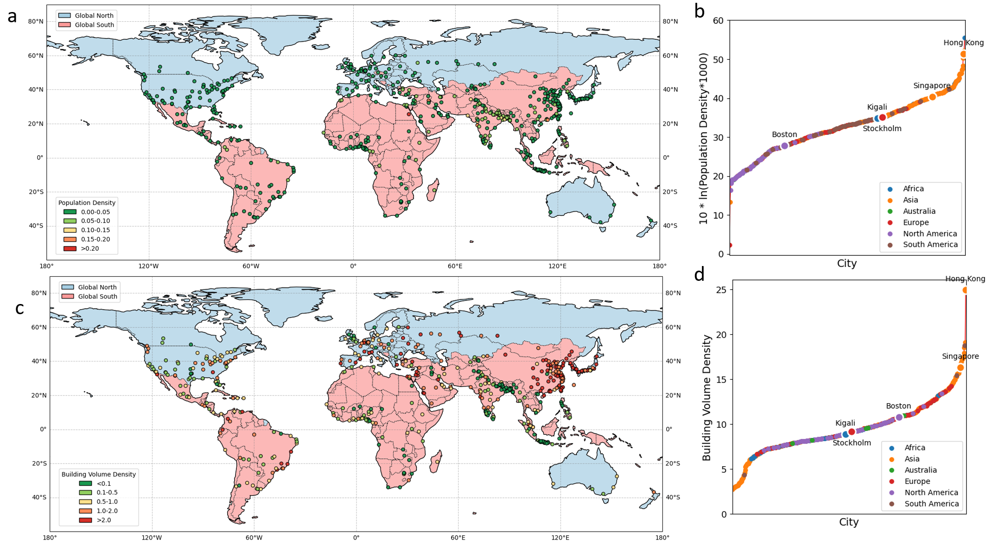

# UrbanControlNet


The repository contains the code implementation of the paper: Envisioning Global Urban Development with Satellite Imagery and Generative AI.




## Table of Contents

- [Introduction](#introduction)
- [Installation](#installation)
- [Dataset Preparation](#dataset-preparation)
- [Model Training](#model-training)
- [Model Testing](#model-testing)
- [Image Prediction](#image-prediction)
- [Acknowledgements](#acknowledgements)
- [Citation](#citation)
- [License](#license)
- [Contact Us](#contact-us)

## Installation

### Dependencies

- Ubuntu
- Python 3.7+, recommended 3.7.0
- PyTorch 1.9.0 or higher, recommended 1.9.1+cu111
- CUDA 12.4 or higher, recommended 12.4

### Environment Installation

We recommend using Miniconda (Conda) for installation. 

**Step 0**: Install [Miniconda](https://docs.conda.io/projects/miniconda/en/latest/index.html).

**Step 1**: Create a virtual environment named `ttp` and activate it.

```shell
conda create -n ttp python=3.7 -y
conda activate idc
```

**Step 2**: Install [PyTorch2.1.x](https://pytorch.org/get-started/locally/).

Linux:
```shell
pip install torch==1.9.1 torchvision==0.10.1 torchaudio==0.9.1 --index-url https://download.pytorch.org/whl/cu111
```

**Step 4**: Install other dependencies.

```shell
pip install matplotlib scipy numpy opencv-python pillow typing-extensions=4.2.0
```

### Install IDC


Download or clone the repository.

```shell
git clone git@github.com:kailaisun/Indoor-Depth-Completion.git
cd Indoor-Depth-Completion
```

## Dataset Preparation

#### Dataset Download

Image and label download address: . It includes:


## Model Training

#### Finetuning

```shell
cd Urbancontrolnet
python train_density.py 
```

#### Finetuning decoder

Set sd_locked = False, then

```shell
python train_density.py
```

## Model Testing

#### Checkpoints:
-Finetuning:[Download](https://1drv.ms/u/s!AnkbiBgsbBltncF0u-3e5rkH2yOTkg?e=WQ1wle)

#### Urban Satelliate Image Generation:

```shell
python results_view_loop_density.py
```


## Metric Prediction Model 
#### Training 

```shell
python prediction_train.py
```

## Acknowledgements


## Citation


## License

The repository is licensed under the [Apache 2.0 license](LICENSE).

## Contact Us

If you have other questions❓, please contact us in time 👬
